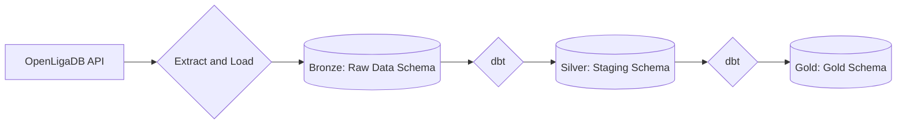

## Football ELT Pipeline

Project showcasing an ELT pipeline using an open football API to periodically update analysis of a Streamlit app.

## Stack

- **Extract / Load**: Python
- **Transform**: dbt
- **Storage**: Neon Postgres DB
- **Frontend Hosting**: Streamlit (WiP) 

## Pipeline Overview

